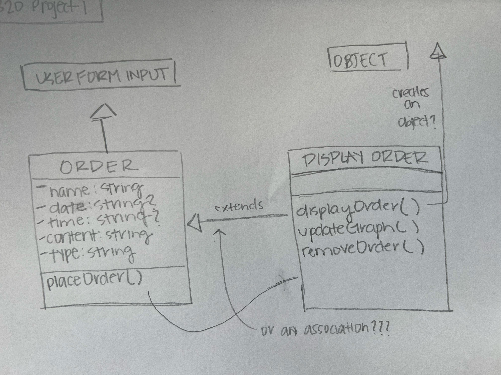

### Elissa Murphy - N320 Project 1

#### Option B - Online Order Tracker

#### Link to GitHub Pages:

---

An application made up of:

- A form that takes in orders from users.
- A class that takes those orders and adds them into the data for your application.
- Another class that reads from that data and displays the orders in a list
  - This class should also handle removing items from the application list.
- Another class that takes that data and visualizes the spread of the 'types' by showing a bar graph of the amounts of each type ordered.

---

My sketches:

